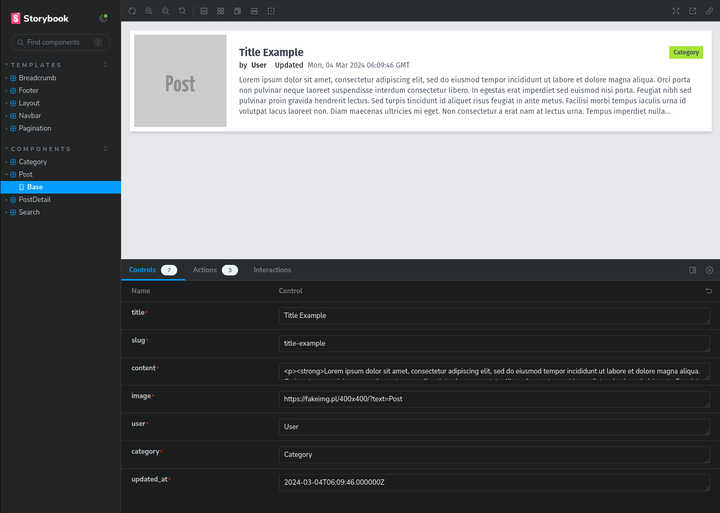

## New Application

#### built with

| Tools  |  |
| :--- | :--- |
| Nest JS  | https://nextjs.org  |
| Tailwind CSS | https://tailwindcss.com  |
| Storybook | https://storybook.js.org |
| etc |  |

#### API

https://github.com/qrizan/laravel-swagger-roles

#### setup .env
```
NEXT_PUBLIC_API_BACKEND = 'http://localhost:8000'
```

#### robots.txt configuration
- src/pages/api/robots.ts
> check URL: http://localhost:3000/robots.txt 

 
#### posts sitemap.xml configuration
- src/pages/sitemap.xml.ts
> check URL: http://localhost:3000/sitemap.xml


#### header tag

- src/components/layouts/Layout.tsx

#### image hostname configuration
- next.config.mjs

```
...
  images: {
    domains: ['localhost'] 
  },
...
```

#### running
```
cd nextjs-tailwind-storybook
npm i
npm run dev
```

#### screenshot


 

#### UI documentation

> npm run storybook

